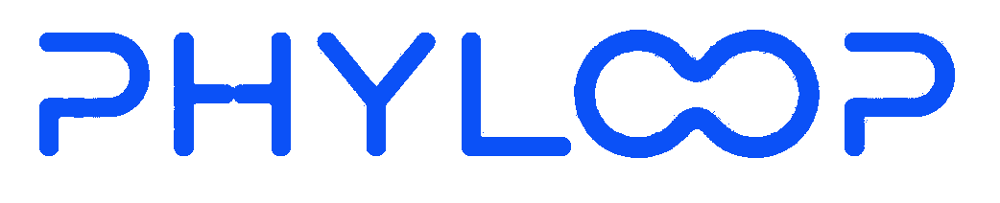

 
# Helping solver-heavy engineering teams test whether surrogate + active learning workflows can reduce expensive simulation volume, with solver-backed validation and fallback rules
 
→ [phyloop.ai](https://phyloop.ai)
